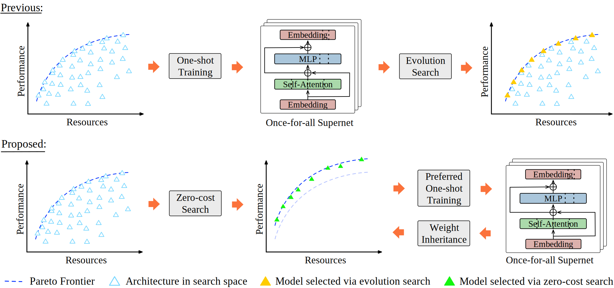

# PreNAS: Preferred One-Shot Learning Towards Efficient Neural Architecture Search

PreNAS is a novel learning paradigm that integrates one-shot and zero-shot NAS techniques to enhance search efficiency and training effectiveness. 
This search-free approach outperforms current state-of-the-art one-shot NAS methods for both Vision Transformer and convolutional architectures, 
as confirmed by its superior performance when the code is released.

>Wang H, Ge C, Chen H and Sun X. PreNAS: Preferred One-Shot Learning Towards Efficient Neural Architecture Search. ICML 2023.

Paper link: [arXiv](https://arxiv.org/abs/2304.14636)

## Overview
<br>
<div align="center"></div>
<br>
Previous one-shot NAS samples all architectures in the search space when one-shot training of the supernet for better evaluation in evolution search. 
Instead, PreNAS first searches the target architectures via a zero-cost proxy and next applies preferred one-shot training to supernet. 
PreNAS improves the Pareto Frontier benefited from the preferred one-shot learning and is search-free after training by offering the models with the 
advance selected architectures from the zero-cost search.

## Environment Setup

To set up the environment you can easily run the following command:
```buildoutcfg
conda create -n PreNAS python=3.7
conda activate PreNAS
pip install -r requirements.txt
```

## Data Preparation 
You need to download the [ImageNet-2012](http://www.image-net.org/) to the folder `../data/imagenet`.

## Run example
The code was run on 8 x 80G A100.
- Zero-Shot Search

  `bash 01_zero_shot_search.sh`

- One-Shot Training

  `bash 02_one_shot_training.sh`

- Evaluation

  `bash 03_evaluation.sh`

## Model Zoo

| Model        | TOP-1 (%)  | TOP-5 (%)     | #Params (M)   | FLOPs (G) | Download Link |
| ------------ | ---------- | ------------- | ------------- | --------- | ------------- |
| PreNAS-Ti    | 77.1       | 93.4          | 5.9           | 1.4       | [AliCloud](https://idstcv.oss-cn-zhangjiakou.aliyuncs.com/PreNAS/supernet-tiny.pth)    | 
| PreNAS-S     | 81.8       | 95.9          | 22.9          | 5.1       | [AliCloud](https://idstcv.oss-cn-zhangjiakou.aliyuncs.com/PreNAS/supernet-small.pth)    |
| PreNAS-B     | 82.6       | 96.0          | 54            | 11        | [AliCloud](https://idstcv.oss-cn-zhangjiakou.aliyuncs.com/PreNAS/supernet-base.pth)    |

## Bibtex

If PreNAS is useful for you, please consider to cite it. Thank you! :)
```bibtex
@InProceedings{PreNAS,
    title     = {PreNAS: Preferred One-Shot Learning Towards Efficient Neural Architecture Search},
    author    = {Wang, Haibin and Ge, Ce and Chen, Hesen and Sun, Xiuyu},
    booktitle = {International Conference on Machine Learning (ICML)},
    month     = {July},
    year      = {2023}
}
```

## Acknowledgements

The codes are inspired by [AutoFormer](https://github.com/microsoft/Cream/tree/main/AutoFormer).
